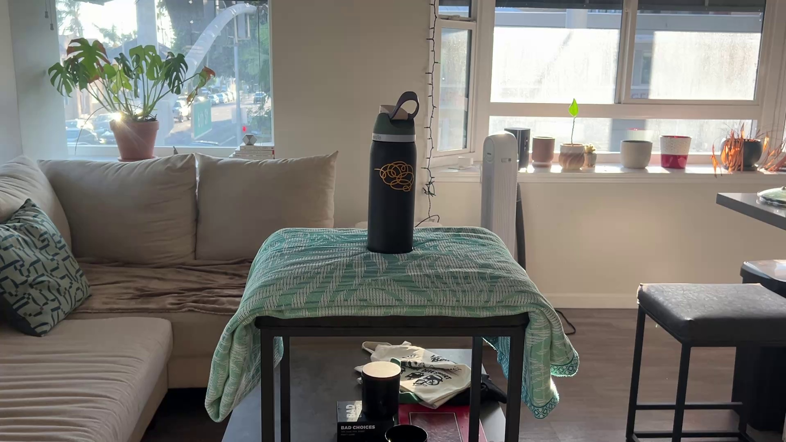
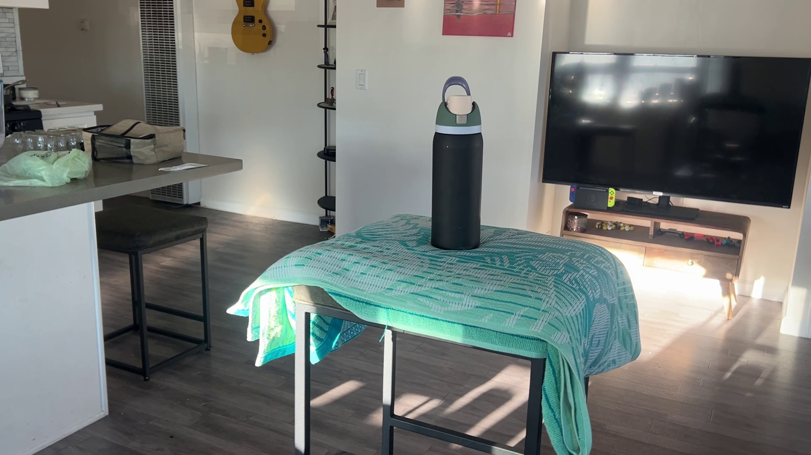
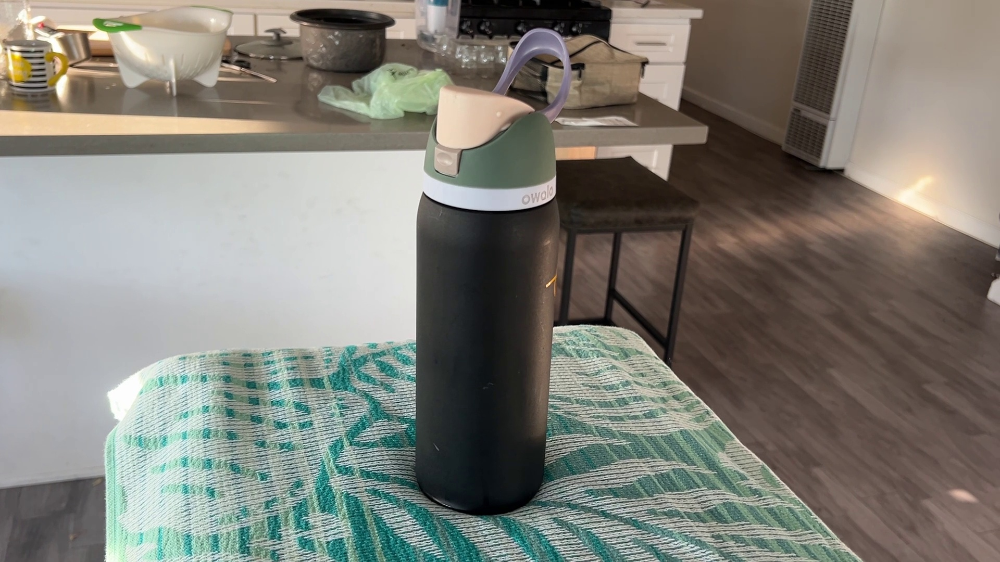
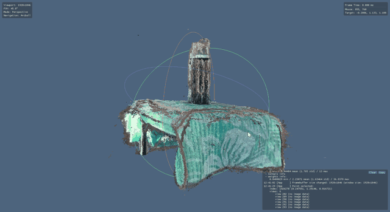
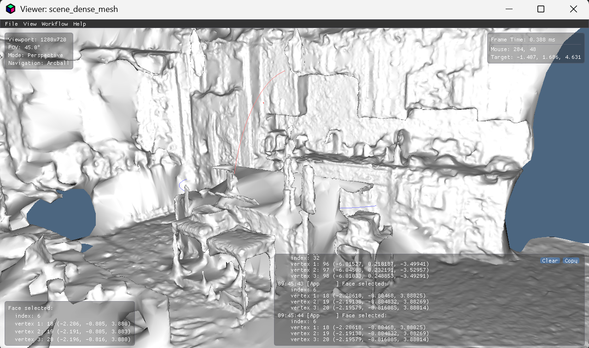

# Real → Sim → Real: 3D Scene Reconstruction for MuJoCo

A self-learning project on the **R2S2R (Real → Sim → Real)** loop used in robot
learning: capture a real scene with a phone, reconstruct it in 3D, bring it into
MuJoCo, train a robot in simulation, and eventually deploy back to the real world.

```
Real world → Capture (iPhone) → 3D reconstruction → Mesh cleanup → MuJoCo → Train policy → Deploy
```

This repo currently covers **Phases 1–3**: turning a walk-around iPhone video into
a dense point cloud and mesh on a laptop **with no NVIDIA GPU**, using COLMAP
(sparse) + OpenMVS (dense, CPU). MuJoCo import, robot spawning (UFACTORY Lite 6)
and RL training are planned next; see [PLAN.md](PLAN.md) for the full roadmap.

## Input

A single 1x-lens iPhone video (~144 s) circling a water bottle on a towel-covered
stool at several heights. 300 frames were sampled from it with
`scripts/extract_frames.py`. Three of them:

| | | |
|---|---|---|
|  |  |  |

The patterned towel is deliberate: photogrammetry needs visual texture to match
features between frames.

## Result

Dense reconstruction from OpenMVS (`scene_dense.ply`), viewed in the OpenMVS viewer:



Full-resolution video: [assets/Scene_dense_Video.mp4](assets/Scene_dense_Video.mp4)

Sparse reconstruction stats (COLMAP), compared with an earlier kitchen capture:

| Metric                    | Bottle scene     | Kitchen (first attempt) |
|---------------------------|------------------|-------------------------|
| Registered images         | 300 / 300 (100%) | 200 / 200 (100%)        |
| Sparse points             | 205,600          | 65,365                  |
| Mean track length         | 8.9              | 8.9                     |
| Mean reprojection error   | 0.61 px          | 0.79 px                 |
| Median reprojection error | 0.48 px          | 0.63 px                 |

### Earlier attempt: the kitchen

The first capture was meant to be a tabletop but ended up being a whole kitchen.
Sparse numbers looked fine, but the dense result was poor:



Large white cabinets and ceilings have almost no texture, stainless steel and tile
are reflective, and pose drift around a big loop caused doubled edges. The lesson:
**a low reprojection error means the camera poses agree with each other, not that
the dense reconstruction will be good.** Switching to a small, textured object at
close range fixed most of this.

## Pipeline

| Step | Script | What it does |
|------|--------|--------------|
| 1. Prepare frames | `scripts/extract_frames.py` | Samples N frames evenly from a video in `video_capture/` (or copies photos from `image_capture/`) |
| 2. Sparse reconstruction | `scripts/run_colmap.py --run from_video` | COLMAP `feature_extractor` → `exhaustive_matcher` (CPU) → `mapper` → `image_undistorter` |
| 3. Dense reconstruction | `scripts/run_openmvs.py --run from_video` | OpenMVS `InterfaceCOLMAP` → `DensifyPointCloud` → `ReconstructMesh` |
| 4. Cleanup | `blender/cleanup_scene.py` | Imports the dense `.ply`, decimates it and exports `scene.obj` for MuJoCo |
| (Compare) | `scripts/compare_reconstructions.py` | Compares video-based and photo-based reconstructions |

```bash
python scripts/extract_frames.py --target-frames 300
python scripts/run_colmap.py --run from_video
python scripts/run_openmvs.py --run from_video
blender --background --python blender/cleanup_scene.py -- <input.ply> <output.obj>
```

Installation (COLMAP no-CUDA build, OpenMVS CPU build, Blender, Python deps) is in
[docs/SETUP.md](docs/SETUP.md).

## Lessons learned (no-GPU edition)

- **COLMAP's dense stereo requires CUDA**, so it won't run on CPU at all. OpenMVS
  does run on CPU, but it's slow: about an hour for 200 frames at 1080p on an
  i7-1065G7.
- **The OpenGL SiftGPU matcher has a hard-coded limit of 16,384 matches** and
  crashes (`STATUS_ACCESS_VIOLATION`) on redundant video frames. Changing the frame
  count or feature caps didn't help. `--FeatureMatching.use_gpu 0` avoids that
  backend entirely.
- OpenMVS writes logs to files, not the console, and puts `depth*.dmap` caches in
  the current directory. Also, `-w` combined with absolute paths doubles the path.
- OpenMVS's dense `.ply` has per-vertex list properties that `trimesh` rejects,
  so `plyfile` is used instead.

[HANDOFF.md](HANDOFF.md) has the full debugging log.

## Repo layout

```
scripts/     frame extraction, COLMAP, OpenMVS, comparison
blender/     mesh cleanup / export to scene.obj
docs/        setup instructions
assets/      README images and result video
PLAN.md      full 7-phase R2S2R roadmap
HANDOFF.md   detailed status and debugging notes
```

Raw captures (`video_capture/`, `image_capture/`) and reconstruction outputs
(`reconstruction/`, `depth*.dmap`) are git-ignored because they're personal and
too large for GitHub.

## Next steps

1. Clean up the bottle-scene mesh in Blender and export `scene.obj`
2. Import it into MuJoCo as a mesh geom
3. Spawn a UFACTORY Lite 6 arm from [mujoco_menagerie](https://github.com/google-deepmind/mujoco_menagerie)
4. Train a simple reach-to-object policy (Stable Baselines3)
5. Add camera-based perception in place of ground-truth object poses
